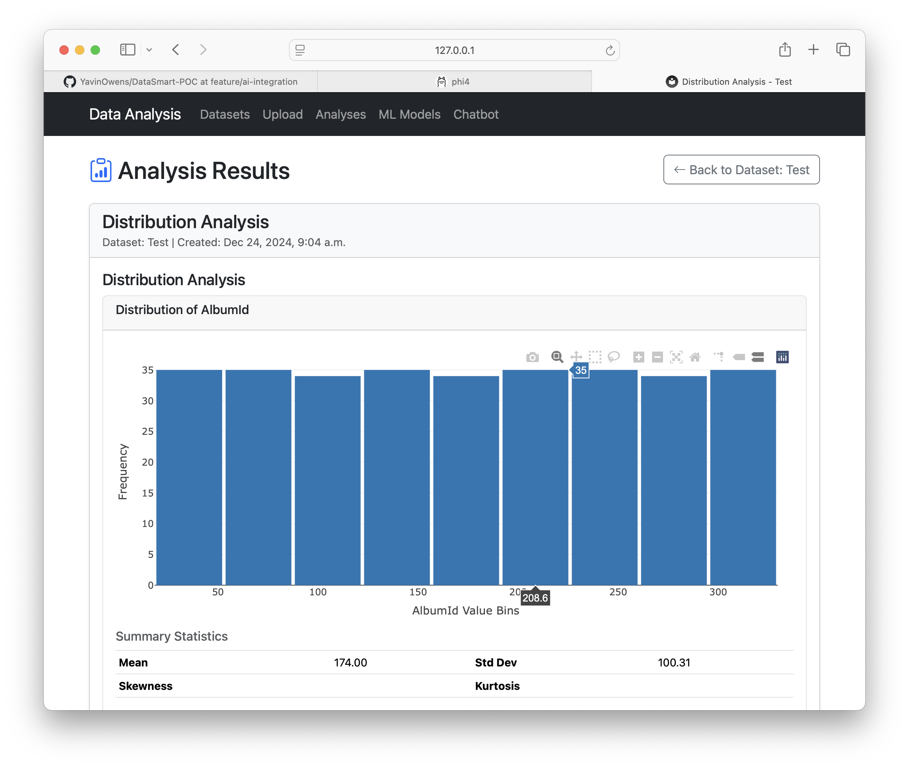

# Data Analysis Web Application

A Django-based web application for data analysis and machine learning. This application allows users to upload datasets, perform various analyses, and train machine learning models through a modern web interface using Bootstrap 5.

## Features

- **Dataset Management**
  - Upload CSV and Excel files (including sheet selection for Excel)
  - View dataset statistics (rows, columns, types) and previews
  - Delete datasets
  - Responsive UI using Bootstrap 5

- **Data Analysis**
  - Basic statistics (mean, std, min, max, etc.)
  - Correlation analysis
  - Distribution analysis

- **Machine Learning**
  - Train various ML models:
    - Classification: Random Forest, Logistic Regression, SVM, Decision Tree
    - Regression: Linear Regression, Random Forest Regressor (extendable)
  - Automatic feature scaling and encoding
  - View model performance metrics

## Screenshots

### Dataset Management

*   View all uploaded datasets in a sortable table.
*   See key info: Name, Size, Columns, Upload Date.
*   Quick actions: View details, Analyze, Delete (with confirmation modal).
*   Clear call-to-action to upload new datasets.

### Dataset Upload

*   Intuitive form for uploading new datasets.
*   Supports CSV and Excel (.xlsx, .xls) files.
*   For Excel: Option to select specific sheets or load all.
*   Progress indicator during upload.
*   Uses `django-crispy-forms` with Bootstrap 5 for clean form rendering.

### Create Analysis

*   Select analysis type (Statistics, Correlation, Distribution).
*   Clear presentation of analysis options using Bootstrap cards.
*   Contextual link back to the selected dataset.
*   Handles multi-sheet Excel files gracefully (analyzes the first sheet).

### Machine Learning Models

*   View trained machine learning models.
*   See model type, dataset used, features, target, and key performance metric.
*   Quick actions: View details, Delete (with confirmation modal).
*   Clear call-to-action to train a new model.

### Chatbot Assistant

*   Select a dataset to discuss.
*   Chat interface for asking questions about the selected dataset.
*   Uses a local Ollama model (`phi4` by default) to generate responses.
*   Provides basic dataset context (columns, preview) to the model.

### Analysis Results (Statistics)

*   Displays basic descriptive statistics (Mean, Std Dev, Min, Max, Percentiles) for numeric columns.
*   Clear tabular presentation using Bootstrap 5.

### Analysis Results (Visualizations)

*   Shows visualizations for analysis types like Distribution (histogram) or Correlation (heatmap).
*   Uses Plotly.js for interactive charts.
*   Includes relevant summary statistics alongside plots.

## Technology Stack

- Python 3.10+
- Django 4.2
- Pandas for data manipulation
- Scikit-learn for machine learning
- Bootstrap 5.3.2 for UI
- Bootstrap Icons 1.11.3
- `django-crispy-forms` with `crispy-bootstrap5`

## Installation

1.  Clone the repository:
    ```bash
    git clone https://github.com/YavinOwens/django_webapp.git
    cd django_webapp # Or your repository directory name
    ```

2.  Create a virtual environment and activate it:
    ```bash
    python -m venv venv
    source venv/bin/activate  # On Windows: venv\Scripts\activate
    ```

3.  Install dependencies:
    ```bash
    pip install -r requirements.txt
    ```

4.  Apply database migrations:
    ```bash
    python manage.py migrate
    ```

5.  Create a superuser (optional, for admin access):
    ```bash
    python manage.py createsuperuser
    ```

6.  Run the development server:
    ```bash
    python manage.py runserver
    ```

    The application will be available at `http://127.0.0.1:8000/`.

## Project Structure

```
.
├── crud_project/         # Django project settings
│   ├── settings.py
│   ├── urls.py
│   └── ...
├── data_analysis/        # Main application
│   ├── models.py         # Database models (Dataset, Analysis, MLModel)
│   ├── views.py          # View logic (Class-based views)
│   ├── forms.py          # Form definitions (DatasetUploadForm, AnalysisForm, etc.)
│   ├── urls.py           # App-specific URL routing
│   ├── templates/        # HTML templates (using Bootstrap 5)
│   │   └── data_analysis/
│   ├── migrations/       # Database migrations
│   └── ...
├── templates/            # Base templates (e.g., base.html)
├── media/                # User uploaded files (datasets)
├── rsc/                  # Resource files (screenshots)
├── manage.py             # Django management script
├── requirements.txt      # Python dependencies
├── db.sqlite3            # Development database
└── README.md             # This file
```

## Usage

1.  **Navigate** to `http://127.0.0.1:8000/`.
2.  **Upload Dataset**: Use the "Upload Dataset" button or link. Fill in the form and select your CSV or Excel file.
3.  **View Datasets**: The main page lists all uploaded datasets. Click "View" to see details.
4.  **Perform Analysis**: From the dataset list or detail page, click "Analyze". Choose an analysis type and view the results.
5.  **Train ML Models**: Navigate to "ML Models" > "New Model". Select a dataset, model type, features, and target, then click "Train Model". View results on the ML Models list or detail page.

## Contributing

1.  Fork the repository.
2.  Create a feature branch (`git checkout -b feature/your-amazing-feature`).
3.  Commit your changes (`git commit -m 'Add some amazing feature'`).
4.  Push to the branch (`git push origin feature/your-amazing-feature`).
5.  Open a Pull Request.

## License

This project is licensed under the MIT License.

## Acknowledgments

- Django framework and community
- Scikit-learn for machine learning functionality
- Bootstrap 5 for UI inspiration